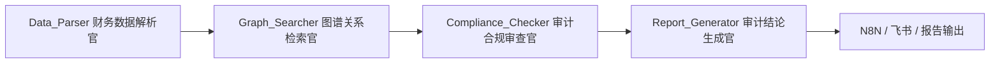

# FinAudit-Graph 技术架构说明

## 总体分层

FinAudit-Graph 按照“数据准备 -> 模型增强 -> 智能体编排 -> 自动化交付”的路线建设。

| 层级 | 工具 | 作用 |
| --- | --- | --- |
| 数据标注与准备层 | Label Studio | 标注审计问答、风险分类、财务违规实体 |
| 模型微调与评估层 | LLaMA Factory | 用 LoRA 演示行业审计能力增强 |
| 智能体编排层 | LangChain Agent、LangGraph | LangGraph 编排四个审计专家节点；LangChain Agent 参与合规审查节点的工具调用和风险判断 |
| 知识增强层 | Neo4j、RAG | 支持关联方穿透和审计准则检索 |
| 自动化与前端层 | Streamlit、N8N、飞书多维表格 | 完成上传、分析、记录、报告生成闭环 |

## 核心状态对象

后续 LangGraph 工作流统一围绕 `AuditSystemState` 流转，建议字段如下：

- `raw_document_path`：原始财报、合同或问询函路径。
- `parsed_financial_data`：结构化企业信息、财务指标和关键文本片段。
- `discovered_related_parties`：Neo4j 或样本数据发现的关联方。
- `audit_risks_found`：合规审查节点识别出的风险点。
- `final_audit_summary`：最终 Markdown 审计综述。
- `error_message`：异常信息，便于演示时解释失败路径。

## 智能体流转

`Compliance_Checker` 内部优先使用 LangChain 1.x Agent。Agent 的基座模型是 DeepSeek OpenAI-compatible chat model，并挂载三个工具：

- `financial_metrics_tool`：分析收入增长、现金流、毛利率和应收账款异常。
- `rag_retriever_tool`：查询本地向量数据库 RAG 审计准则。
- `related_party_tool`：总结 Neo4j/JSON fallback 发现的关联方线索。

如果 Agent 未配置、调用失败或输出格式不符合风险 JSON 结构，节点会自动回退到 DeepSeek 直接结构化调用，再失败则使用本地规则版，保证答辩演示稳定。

## Day 1 验收口径

- 仓库目录清晰，能支撑 Day 2 到 Day 7 的材料和代码沉淀。
- README 能说明项目目标、冲刺路线和运行方式。
- Python 包入口可运行，能输出当前工程状态。
- 配置项集中在 `.env.example`，不把真实密钥提交进仓库。
